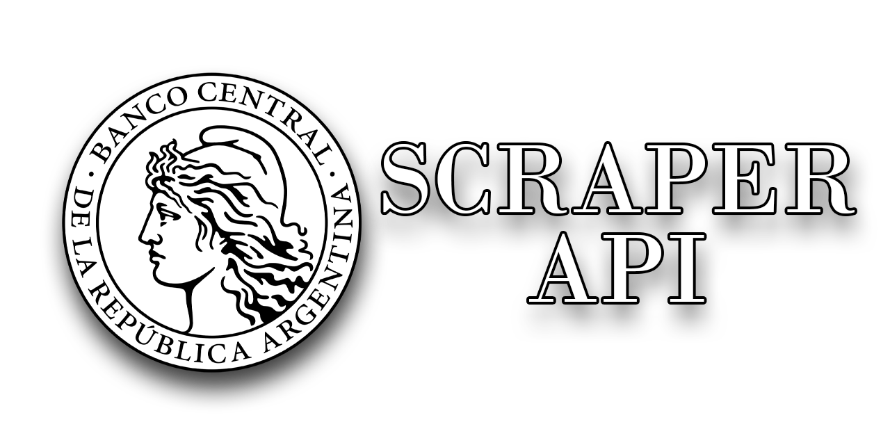

# BCRA Scraper API

 
  

   

## Introducción

API creada con FastAPI que utiliza scraping para obtener la lista de bancos oficiales publicados por BCRA.

Mediante la API se podrá administrar la lista de bancos obtenidos y guardados en la base de datos.

Además, al estar crada con FastAPI, la documentación de la API está creada automáticamente y se puede acceder mediante el path `/docs` (Swagger UI) o `/redoc` (ReDoc).
